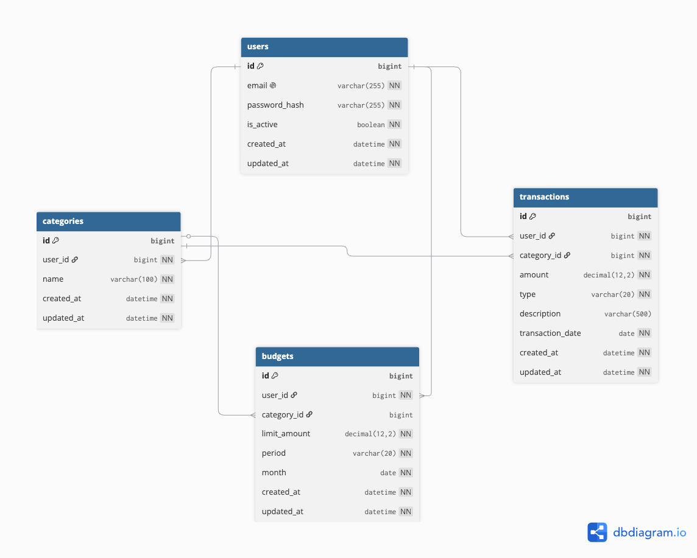

# 💰 Finance Tracker API


A personal finance management API built with FastAPI and SQLAlchemy to manage a PostgreSQL database, with a Telegram bot for quick access on the go.

## 🚀 Features

+ 🔐 JWT authentication
+ 👤 User registration and management
+ 📂 Category management (CRUD operations)
+ 💸 Transaction management (CRUD operations)
+ 📊 Budget management (CRUD operations)
+ 🛡️ Data isolation — users can only access their own data
+ 🤖 Telegram bot with full feature parity to the API

## 🛠️ Tech Stack

+ **Python 3.12**
+ **FastAPI 0.136**
+ **SQLAlchemy 2.0**
+ **PostgreSQL 16**
+ **Alembic**
+ **Docker**
+ **JWT (python-jose)**
+ **aiogram** (Telegram bot)
+ **pytest**

## ✅ Requirements

+ Python 3.12+
+ PostgreSQL 16+
+ Docker & Docker Compose (for Docker setup)
+ A Telegram Bot Token (for the bot, optional)

## 🗂️ Project Structure

```
finance-tracker-api/
├── app/
│   ├── api/
│   │   ├── endpoints/      # Route handlers
│   │   └── dependencies.py # FastAPI dependencies
│   ├── bot/                # Telegram bot
│   │   ├── handlers/       # Bot command and callback handlers
│   │   ├── keyboards/      # Inline and reply keyboards
│   │   ├── api_client.py   # HTTP client to talk to the API
│   │   ├── helpers.py      # Shared bot helper functions
│   │   ├── storage.py      # In-memory session storage
│   │   └── main.py         # Bot entry point
│   ├── core/               # Config and database
│   ├── exceptions/         # Custom exceptions
│   ├── models/             # SQLAlchemy ORM models
│   ├── repositories/       # Database queries
│   ├── schemas/            # Pydantic schemas
│   ├── services/           # Business logic
│   ├── utils/              # JWT and security
│   └── main.py
├── tests/
│   ├── unit/
│   └── integration/
├── alembic/                # Database migrations
├── docs/
│   └── db_schema.png
├── docker-compose.yml
├── Dockerfile
└── requirements.txt
```

## 🗄️ Database Schema



## 🛠️ Installing / Getting started

### 1. 📥 Clone project from GitHub to local computer

Open the terminal in the directory where you want to place the project and run:

```bash
git clone git@github.com:dmytrominyaylo/finance-tracker-api.git
```

### 2. 🐍 Create and activate virtual environment

```bash
python -m venv .venv
```

To activate virtualenv:

a) On macOS/Linux:
```bash
source .venv/bin/activate
```

b) On Windows:
```bash
.venv\Scripts\activate
```

### 3. 📦 Install project dependencies

```bash
pip install -r requirements.txt
```

### 4. ⚙️ Create a .env file

Rename `.env.example` file to `.env`. Open it and fill in all variables with your configuration settings, including `TELEGRAM_BOT_TOKEN` if you want to run the bot.

### 5. 🐳 Run project with Docker

The project is Dockerized for easy setup. Migrations run automatically on startup.

```bash
docker-compose up --build
```

### 6. 🖥️ Run project locally

Apply migrations:
```bash
alembic upgrade head
```

Start FastAPI app:
```bash
uvicorn app.main:app --reload
```

## 📖 API Documentation

After starting the server, open Swagger UI:

```
http://localhost:8000/docs
```

## 🧪 Testing the API

1. Register a new user via `POST /api/users/`
2. Login via `POST /api/auth/login` to get an access token
3. Click the **Authorize** 🔒 button in Swagger UI
4. Enter the token in the format: `Bearer your_token_here`
5. Now all protected endpoints are available

## 🤖 Telegram Bot

The project includes a Telegram bot that mirrors the API's functionality, letting users manage their finances directly from Telegram.

**Features:**
+ Sign up / Sign in / Sign out with confirmation
+ Category management with an emoji picker and name suggestions
+ Transaction and budget management
+ Delete one, several (multi-select), or all items at once
+ Balance overview with income/expense breakdown by category
+ User settings: profile, change email, change password, delete account

**Running the bot:**

Make sure the API server is running, then in a separate terminal:

```bash
python -m app.bot.main
```

## 🧬 Running Tests

```bash
pytest
```

Or with verbose output:
```bash
pytest -v
```

## 👤 Author

**Dmytro Minyaylo**
+ GitHub: [@dmytrominyaylo](https://github.com/dmytrominyaylo)